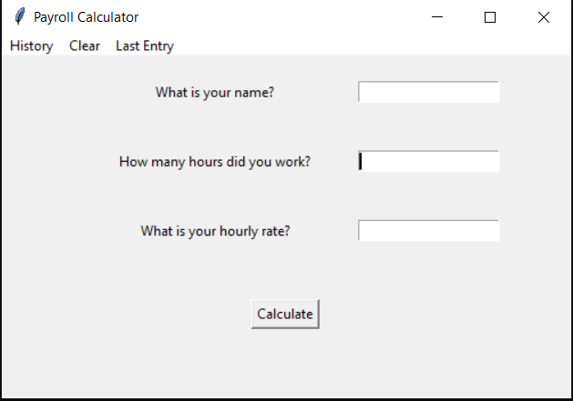

# py-payroll-calc
A simple GUI Python payroll calculator

### Features
 - last entry
 - history
 - clear data
 - base64 textfile database

### Screenshot

## LICENSE 
[Apache-2.0](https://www.apache.org/licenses/LICENSE-2.0)[@eru123](https://github.com/eru123)
